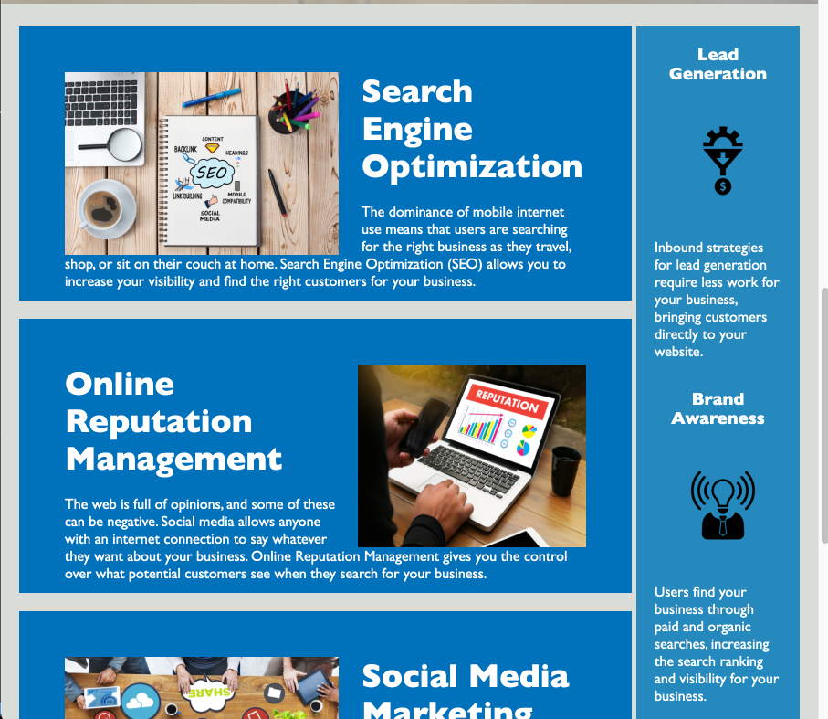

# Horiseon-Refactoring

## Table of Contents

Click the links below to jump to that section!

- [Description](#description)
- [Credits](#credits)
- [License](#license)

## Description

Provide a short description explaining the what, why, and how of your project. Use the following questions as a guide:

- What was your motivation?\

  - To use semantic language to improve the accessibility and SEO score of the page.

- Why did you build this project?\
   -To use different HTML elements instead of only just divs to optizimze the acessibility and SEO score.

- What problem does it solve?\

  - This project simplifies the tag names and make the creates a better optimization for the rendering of the page.

- What did you learn?\
  -I learned about refactoring code and different style to go about responsive layouts.
  -I learned that there are many ways to go about the same task.
  -Learned about repositories, and making a dynamic page

# [Click here to go to the page!](https://elvis2681.github.io/codeRefactor/)

